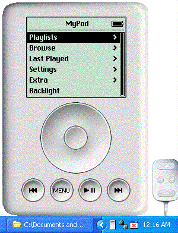



## iPod

### Description

A functional but incomplete iPod clone. Seeing as I don't own an iPod, I would like/require help from those who do. Updated interface. And remote. Added media Databasing and the block game, and now the parachute game. Fixed the bugs where the title bar wouldnt refresh, and the brick game started prematurely. Fixed a bug where now playing wouldnt claim the menu mode, and added keyboard controls
 
### More Info
 

             |
---                |---
**Submitted On**   |2004-03-18 15:57:32
**By**             |[Techni Rei Myoko](https://github.com/Planet-Source-Code/PSCIndex/blob/master/ByAuthor/techni-rei-myoko.md)
**Level**          |Advanced
**User Rating**    |4.4 (22 globes from 5 users)
**Compatibility**  |VB 6\.0
**Category**       |[Sound/MP3](https://github.com/Planet-Source-Code/PSCIndex/blob/master/ByCategory/sound-mp3__1-45.md)
**World**          |[Visual Basic](https://github.com/Planet-Source-Code/PSCIndex/blob/master/ByWorld/visual-basic.md)
**Archive File**   |[iPod1721823192004\.zip](https://github.com/Planet-Source-Code/techni-rei-myoko-ipod__1-52309/archive/master.zip)

